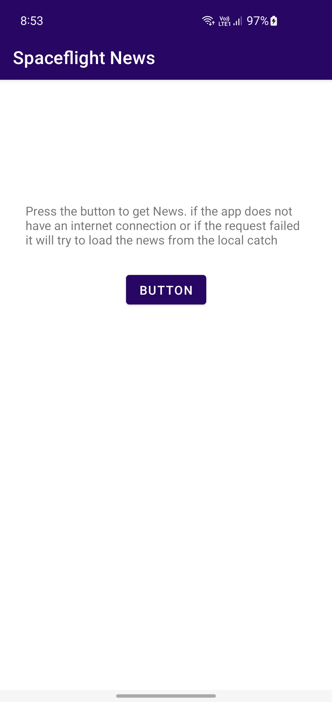

# SpaceFlight News

## Description 

- This is a news app that displays the latest news about spaceflight. It is an offline first app 
  by caching the content in the database. 
  
- I have used Model View ViewModel (MVVM) design pattern with clean architecture recommendations, 
  such us separation of concerns and testability.
  
- I have implemented the remote and domain data layers bridges through mappers inorder to make the 
  network model easily replaceable.
  
- I have used Dagger-Hilt for the dependency injection.

- I have implemented local cache using room database and keeping the repository as single source 
  of truth.
  

## Instructions
- In order to run the app just clone this repository and just press the button below to the guiding 
  text
  

## Photos

